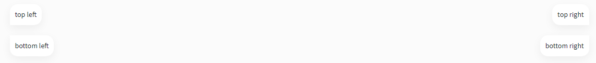

<div align="center">
<h1>Documentation</h1>

<p>Admin part</p>
</div>

## Contents
- [Buttons](#button)
  - [Examples](#examples)
  - [Sizes](#sizes)
- [Links](#links) 
- [Tables](#tables) 
  - [Tables buttons top bottom](#tables_buttons_top_bottom)


## Button

### Examples


```
<button type="button" class="btn admin-btn-primary">primary</button>
<button type="button" class="btn admin-btn-primary-o">primary outline</button>
<button type="button" class="btn admin-btn-secondary">secondary</button>
<button type="button" class="btn admin-btn-danger">secondary</button>
<button type="button" class="btn disabled" disabled >disabled</button>
<button type="button" class="btn disabled-o" disabled >disabled outline</button>

```

### Sizes

  Add  `.btn-sm` or `.btn-md` or `.btn-lg` 

  

```
<button type="button" class="btn admin-btn-primary btn-sm">primary</button>
<button type="button" class="btn admin-btn-primary-o btn-md">primary outline</button>
<button type="button" class="btn admin-btn-secondary btn-lg">secondary</button>
```

  Full width add `.d-block` or `.w-100` 

   

```
<button type="button" class="btn admin-btn-danger d-block">danger</button>
<button type="button" class="btn admin-btn-danger w-100">danger</button>
```

## Links

 

```
<a href="#" class="admin-link">link link</a>
```

## Tables

### Tables buttons top bottom

  #### Exampls

 

```
// top left, right
    <div class="table-btn-top">
      <div class="table-btn left">
        top left
      </div>
      <div class="table-btn right">
        top right
      </div>
    </div>

// bottom left right
    <div class="table-btn-bottom">
      <div class="table-btn left">
        bottom left
      </div>
      <div class="table-btn right">
        bottom right
      </div>
    </div>
```
