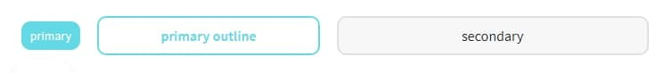
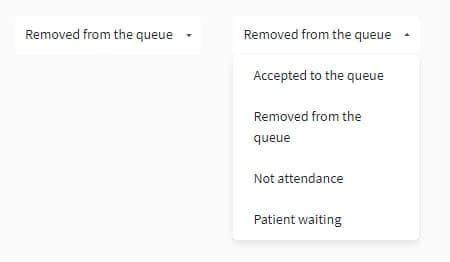
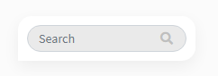
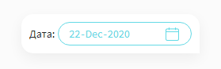
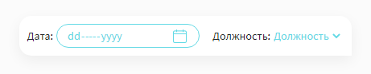
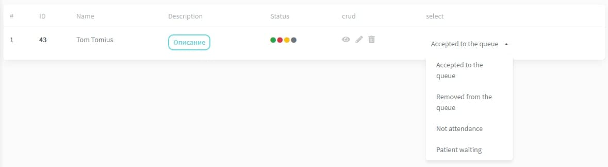
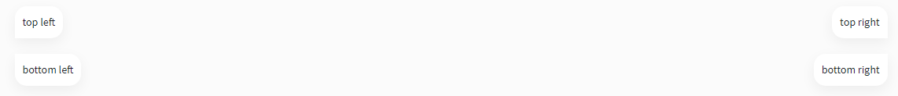

<div align="center">
<h1>Documentation</h1>

<p>Admin part</p>
</div>

## Contents

- [Buttons](#button)
  - [Examples](#examples)
  - [Sizes](#sizes)
- [Links](#links)
- [Forms](#forms)
  - [Select](#select)
    - [Simple select](#simple-select)
  - [Search](#search)
  - [Date](#date)
  - [Example forms date and select](#example-forms-date-and-select)
- [Tables](#tables)
  - [Example custom table](#example-custom-table)
  - [Table buttons top bottom](#table-buttons-top-bottom)

## Button

### Examples


```
<button type="button" class="btn admin-btn-primary">primary</button>
<button type="button" class="btn admin-btn-primary-o">primary outline</button>
<button type="button" class="btn admin-btn-secondary">secondary</button>
<button type="button" class="btn admin-btn-danger">secondary</button>
<button type="button" class="btn admin-btn-link">link</button>
<button type="button" class="btn disabled" disabled >disabled</button>
<button type="button" class="btn disabled-o" disabled >disabled outline</button>
```

### Sizes

Add `.btn-sm` or `.btn-md` or `.btn-lg`

  

```
<button type="button" class="btn admin-btn-primary btn-sm">primary</button>
<button type="button" class="btn admin-btn-primary-o btn-md">primary outline</button>
<button type="button" class="btn admin-btn-secondary btn-lg">secondary</button>
```

Full width add `.d-block` or `.w-100`

   

```
<button type="button" class="btn admin-btn-danger d-block">danger</button>
<button type="button" class="btn admin-btn-danger w-100">danger</button>
```

## Links

Add `.admin-link`

 

```
<a href="#" class="admin-link">link link</a>
```
## Forms

### Select

 

```
// html
  <div class="select_wrap">
    <ul class="default_option">
      <li>
        <div class="option accepted_queue">
          <p>Accepted to the queue</p>
        </div>
      </li>
    </ul>
    <ul class="select_ul">
      <li>
        <div class="option accepted_queue">
          <p>Accepted to the queue</p>
        </div>
      </li>
      <li>
        <div class="option removed_queue">
          <p>Removed from the queue</p>
        </div>
      </li>
      <li>
        <div class="option not_attendance">
          <p>Not attendance</p>
        </div>
      </li>
      <li>
        <div class="option waiting">
          <p>Patient waiting</p>
        </div>
      </li>
    </ul>
  </div>
```

```
//jQuery
  $(document).ready(function() {
    $(".default_option").click(function() {
      $(this).parent().toggleClass("active");
    })
    $(".select_ul li").click(function() {
      var currentele = $(this).html();
      $(".default_option li").html(currentele);
      $(this).parents(".select_wrap").removeClass("active");
    })
  });
```
#### Simple select


```
  <div class="table-btn-top">
    <div class="table-btn right d-flex">
        <form class="form-inline form-select">
            <label>Должность: </label>
            <select class="select">
                <option selected>Должность</option>
                <option value="1">One</option>
                <option value="2">Two</option>
                <option value="3">Three</option>
            </select>
        </form>
    </div>
  </div>
```
### Search 



```
  <div class="table-btn-top">
      <div class="table-btn left">
          <form class="form-inline form-search">
              <input class="form-control" type="search" placeholder="Search" aria-label="Search">
              <i class="fa fa-search"></i>
          </form>
      </div>
  </div>
```

### Date



```
  <div class="table-btn-top"> 
    <div class="table-btn right d-flex">
        <form class="form-inline form-date">
            <label>Дата: </label>
            <input class="form-control ml-1" type="date">
        </form>
    </div>
  </div>
```

### Example forms date and select



```
  <div class="table-btn-top">
    <div class="table-btn right d-flex">
        <form class="form-inline form-date">
            <label>Дата: </label>
            <input class="form-control ml-1" type="date">
        </form>
        <form class="form-inline form-select ml-3">
            <label>Должность: </label>
            <select class="select">
                <option selected>Должность</option>
                <option value="1">One</option>
                <option value="2">Two</option>
                <option value="3">Three</option>
            </select>
        </form>
    </div>
  </div>
```
## Tables

### Example custom table



```
// html
<table class="table admin-table my-5">
  <thead>
    <tr>
      <th>#</th>
      <th>ID</th>
      <th>Name</th>
      <th>Description</th>
      <th>Status</th>
      <th>crud</th>
      <th>select</th>
    </tr>
  </thead>
  <tr>
    <td>1</td>
    <td class="font-weight-bold text-dark">
      43
    </td>
    <td>Tom Tomius</td>
    <td>
      <a href="#" class="btn admin-btn-primary-o btn-sm">Описание</a>
    </td>
    <td>
      <i class="fa fa-circle fa-xs text-success" aria-hidden="true"></i>
      <i class="fa fa-circle fa-xs text-danger" aria-hidden="true"></i>
      <i class="fa fa-circle fa-xs text-warning" aria-hidden="true"></i>
      <i class="fa fa-circle fa-xs text-muted" aria-hidden="true"></i>
    </td>
    <td>
      <a href="#" class="admin-crud view" title="View" aria-label="View">
        <i class="fa fa-eye" aria-hidden="true"></i>
      </a>
      <a href="#" class="admin-crud update px-2" title="Update" aria-label="Update">
        <i class="fa fa-pencil-alt" aria-hidden="true"></i>
      </a>
      <a href="#" class="admin-crud delete" title="Delete" aria-label="Deletedata-confirm="Are you sure you want to delete this item?" data-method="post">
        <i class="fa fa-trash-alt" aria-hidden="true"></i>
      </a>
    </td>
    <td>
      <div class="select_wrap select-btn-status">
        <ul class="default_option">
          <li>
            <div class="option accepted_queue">
              <p>Accepted to the queue</p>
            </div>
          </li>
        </ul>
        <ul class="select_ul">
          <li>
            <div class="option accepted_queue">
              <p>Accepted to the queue</p>
            </div>
          </li>
          <li>
            <div class="option removed_queue">
              <p>Removed from the queue</p>
            </div>
          </li>
          <li>
            <div class="option not_attendance">
              <p>Not attendance</p>
            </div>
          </li>
          <li>
            <div class="option waiting">
              <p>Patient waiting</p>
            </div>
          </li>
        </ul>
      </div>
    </td>
  </tr>
</table>
```

```
//jQuery for select
  $(document).ready(function() {
    $(".default_option").click(function() {
      $(this).parent().toggleClass("active");
    })
    $(".select_ul li").click(function() {
      var currentele = $(this).html();
      $(".default_option li").html(currentele);
      $(this).parents(".select_wrap").removeClass("active");
    })
  });
```
### Table buttons top bottom

#### Exampls

 

```
// top left, right
    <div class="table-btn-top">
      <div class="table-btn left">
        top left
      </div>
      <div class="table-btn right">
        top right
      </div>
    </div>

// bottom left right
    <div class="table-btn-bottom">
      <div class="table-btn left">
        bottom left
      </div>
      <div class="table-btn right">
        bottom right
      </div>
    </div>
```